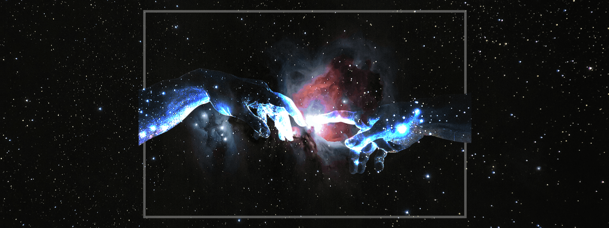

# hi i'm sanjith.

cs student, working on open-source stuff

| field | skills |
| --- | --- |
| programming |       |
| ai/ml |     |
| web-dev |        |
| embedded systems |   |
| dev tools |    |

